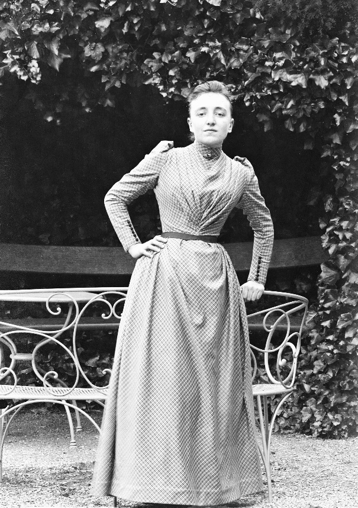
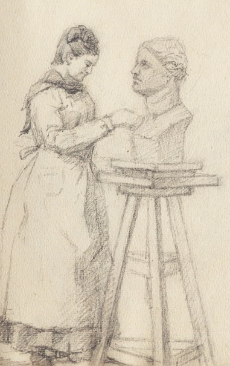
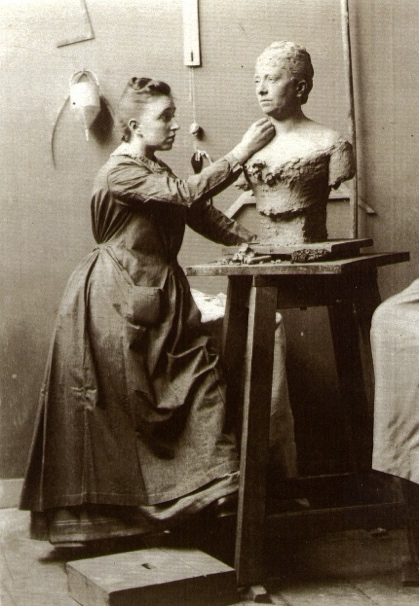
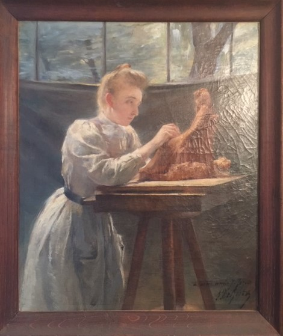

*Jeanne Jozon, as a young woman, in the family garden*

---

# Rediscovering Jeanne Jozon

## "A Woman Artist of Art Nouveau"

*Exhibition project led by Jean-Noël Jeanneney and Pierre Allorant*

---

Jeanne Jozon — sculptor of the Art Nouveau, trained at the École nationale des Beaux-Arts de Bourges (the State Fine Arts school in Bourges) and then at the Académie Julian (a private Paris academy that, exceptionally for its time, admitted women) — was greatly admired by American collectors and remains, even today, little known in France.

Born in Paris in **1868**, she left behind a long-running family correspondence and professional papers spanning her childhood during the *Dix décisives* (the "decisive ten" years of the long incubation of the Third Republic) all the way to the German Occupation.

---

## A family of the republican bourgeoisie

Her family, social, cultural, and political milieu — the republican bourgeoisie of lawyers, doctors, and engineers — is readily approachable through the abundant writings left by:

**Her father, Paul Jozon** — *Avocat aux Conseils* (a barrister authorized to plead before the highest French courts) and a Gambettist deputy.

**Her uncle, Marcel Jozon** — graduate of the École polytechnique and the École des Ponts ("X-Ponts"), vice-president of the Conseil général des Ponts-et-Chaussées (the senior state engineering body), and father-in-law of Senate president Jules Jeanneney.

**Her maternal grandfather, Adolphe Lacan** — *Bâtonnier* (head) of the Paris bar, celebrated for his *Treatise on the Legislation and Jurisprudence of the Theatres* and for his pleading against Alexandre Dumas.

---

## Artistic training

*Sketch of Jeanne Jozon at work*

Jeanne Jozon received an exceptional double artistic training:

### École des Beaux-Arts de Bourges

A student of **Pètre** at the École nationale des Beaux-Arts de Bourges — recently founded by the radical mayor Eugène Brisson, her step-grandfather — she studied alongside **Lucien Pénat**, who would remain her lifelong friend.

### Académie Julian, Paris

She continued her training under **Puech** at the prestigious Académie Julian, one of the few institutions of the period that accepted women artists.

---

## The studio at rue de Babylone

*Jeanne Jozon sculpting a bust in her studio at rue de Babylone*

She set up her sculpture studio on **rue de Babylone**, just behind the Bon Marché department store, where she would create the bulk of her œuvre.

---

## A wide-ranging and prolific body of work

*Portrait of Jeanne Jozon at work, oil on canvas*

Jeanne Jozon worked in remarkably varied media and materials:

### Sculpture

- Marble and bronze castings
- Tabletop bas-reliefs of fashionable women, in poses inspired by Egyptian relief carving
- Breton peasant women and small Berry farmboys
- Busts of young girls and of mothers with their children, symbolizing the future

### Signature works

- *La charmeuse de serpent* (The Snake Charmer)
- *La joueuse de flûte* (The Flute Player)
- *La jeune fille jouant avec sa tortue* (Young Girl Playing with Her Tortoise)
- *Les petits paysans berrichons juchés sur un mur* (Little Berry Peasants on a Wall)
- Bust of her friend Lucien Pénat

### Ceramics

Models for the manufactures of **Sèvres** and **Mehun-sur-Yèvre**, in collaboration with the ceramicist **Edmond Lachenal**.

### Drawings and pastels

The sculptor was also a **gifted draughtswoman and pastellist** — Breton landscapes, the Creuse valley, and Mehun.

### Photography

She made beautiful photographs of landscapes and portraits, on plates printed at the Bon Marché.

---

## Recognition and exhibitions

Jeanne Jozon exhibited regularly in the Paris salons and became a *sociétaire* (full member) of several of them.

### Distinctions

- **1897** — Honourable mention at the Salon for *À la fontaine* (At the Fountain)
- **1898** — Officier d'Académie (a French civil distinction for service to education and the arts)
- **1910** — Palmes Académiques (a higher grade of the same distinction)

### International reach

In the years following the Great War, she took part in the **French Toys exhibition in New York** in 1919, which showcased the patriotic enterprise of substituting French-made toys for the imports labelled *Made in Germany*.

---

## Teaching

She taught sculpture to a wide circle of young students. Some of her drawings and sketches served as models for jewelry she fashioned and for tapestries.

---

## Final years

During the Occupation, with her sculpture studio unworkable for lack of coal to heat it, she turned to still lifes.

She died in **1946**.

---

## Posthumous tribute

A year after her death, the **Palais des Beaux-Arts de la Ville de Paris** organized, in **1947**, a memorial exhibition on avenue du Président Wilson.

---

## An independent artist

> **Jeanne Jozon was a woman artist who explicitly chose celibacy as the only means, within the bourgeois and patriarchal society of the *Belle Époque*, of preserving her independence and seeing her work through.**

The extensive documentation archived by the Jozon families — contracts, photographs of works, family correspondence, sketchbooks — together with the hundred or so works that have been preserved, makes it possible today to bring this great sculptor, too long forgotten, back into the light.

---

---

# Appendices

## The Académie Julian (1868–1946)

A private academy of painting and sculpture founded by **Rodolphe Julian** in 1868, the Académie Julian began admitting women in **1880** in a dedicated studio at 51, rue de Vivienne.

Renowned painters led the studios, including **William Bouguereau** and **Jean-Paul Laurens**. The Academy gained a strong international reputation and attracted many French and foreign students.

Closed during the Second World War, the Académie sold most of its studios in 1946. Bought back in 1959, it became the École supérieure d'Arts graphiques (ESAG).

### Archives of the Académie Julian

- 63AS/1 — General catalogue of students (1870–1919)
- 63AS/10–11 — Women: nationalities and surnames (1868–1928)
- 63AS/12–14 — Studio enrolments (1877–1907)
- 63AS/25–26 — Correspondence (1877–1938)

---

## Bibliography

### On the Académie Julian

Fehrer, Catherine, *"The Julian Academy, Paris 1868–1939"*, Shepherd Gallery, New York, 1989.

### On the French Toys exhibition

- *French Toys*, illustrated by André Hellé, Éditions de l'Avenir féminin, Paris, 1915
- *Étrennes, jouets 1915–1916*, Au Bon Marché, Paris, cover by Poulbot
